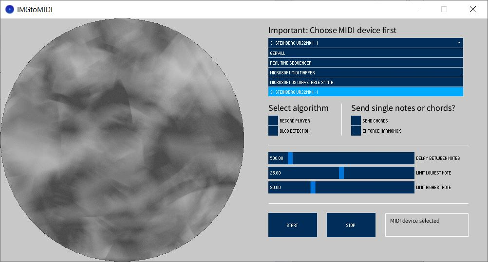

# IMGtoMIDI

Objective: Converting a static image to MIDI signals using blob detection and a probing method akin to a phonograph. Autodetecting suitable MIDI interfaces/devices on the target system and providing a simple GUI. More info [here](https://andi-siess.de/image-to-music/). 

## current status
Prototype is working but a lot of features are highly work in progress. 

## used libraries
- the midibus (for detecting MIDI devices and sending MIDI signals/messages)
- cp5 (for GUI)
- theBlobDetection (for blob detection)

## todos
- [x] Using modulo and framecount for cycling through main array
- [x] Get rid of `delay()` between `noteOn` and `noteOff` by using `millis()`
- [x] Implementing phonograph and blob detection as approaches to 'probe' the image
- [x] Include radio buttons to choose between these two approaches
- [x] Exclude the calculation of blobs and phonograph probe from `draw()`. These calculations are done now once the radio buttons are checked.
- [ ] Threading (using `threads()` seems to mess up the timing)
- [x] Better way to send `NoteOff` (depending on the frame rate it is sent more than once)
- [x] More harmonic alterations of the notes
- [x] Include text field in GUI with current status (or at least all console logs)
- [x] Better way to sending MIDI panic message (`CC 120` or `CC 123`) than the for loop that is currently in place
- [x] Include option to include accords
- [x] Implement button in GUI to load image
- [ ] Blob detection threshold should be configurable via the GUI
- [ ] The MIDI devices dropdown list can't be closed at the moment which leads to a confusing UI when the device is changed after the initial selection.
 
## prerequisites
- loaded images need to have an aspect ratio of 1:1
- when using the phonograph approach all neccessary image content needs to be in a circle with an origin at `image.height/2` and `image.width/2` and a radius of `image.width/2`. All content in the corners will be ignored.
- preferred image format is *.jpg
- images should have a resolution of 400 x 400 (minumum) and 1000 x 1000 (maximum)
- images *should* be black and white (see limitations below)
- when chords or harmonics are enforced the external synthesizer must be capable of producing polyphonic voices. Also the synthesizer needs to be switched to polyphonic mode. There seems to be a MIDI controller change function that is capable of doing this, but my only testing device (*Arturia Microfreak*) does not seem to respect that. Therefore the respective line in the code (`myBus.sendControllerChange(1, 127, 0);`) is commented out at the moment. (A very nice table of all MIDI messages can be found [here](https://nickfever.com/music/midi-cc-list)) 

## limitations
- the phonograph/spiral procedure currently only uses the `red()` color channel for probing (for black and white images this limitation is not particularly relevant, but should be adressed in the future)
- the blob detection approach uses only the `x`-coordinates of each blob for creating MIDI signals